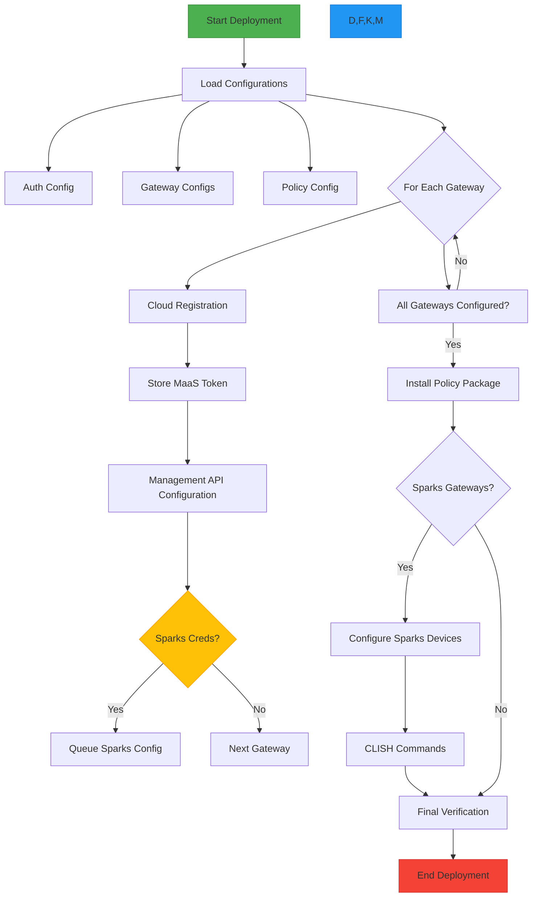

# Smart-1 Cloud Gateway Deployment Orchestrator

Automated deployment and configuration system for Check Point Smart-1 Cloud gateways with physical device integration.

## Features
- Automated gateway registration in Smart-1 Cloud
- Centralized management configuration
- Policy package deployment
- Physical gateway provisioning
- Comprehensive logging and error handling
- Configuration validation with Pydantic models
- Retry logic for API operations

## Prerequisites
- Check Point Smart-1 Cloud account
- Valid API credentials (client ID/access key)
- Management API key
- Python 3.9+
- Physical gateways with REST API access

## Installation

```bash
# Clone repository
git clone https://github.com/alshawwaf/smart1_cloud_sparks_deployer.git
cd smart1_cloud_sparks_deployer

# Create virtual environment
python.exe -m venv .venv

# Create virtual environment (Linux)
python3 -m venv.venv

# Activate environment (Windows)
.venv\Scripts\activate

# Activate environment (Linux)
source .venv/bin/activate

# Install dependencies
pip install -r requirements.txt
```

## Configuration
1. Create config directory
2. Add configuration files"

- config/auth_data.json

```json
{
    "client_id": "your-client-id",
    "access_key": "your-access-key",
    "portal_url": "https://cloudinfra-gw-us.portal.checkpoint.com",
    "instance": "your-instance",
    "context": "your-context-uuid",
    "api_key": "your-management-api-key"
}
```

- config/config_data.json

```json
[
        {
        "gw_name": "sparks1",
        "version": "R81.10",
        "hardware": "1575/1595",
        "net_type": "Wireless",
        "sic_key": "your-sic-key",
        "gateway_ip": "203.0.113.171:4434", //Optional. to configure local applicance over rest API
        "gateway_username": "admin", //Optional. to configure local applicance over rest API
        "gateway_password": "secure-password" //Optional. to configure local applicance over rest API
    }},
    {
        "gw_name": "sparks2",
        "version": "R82",
        "hardware": "1800",
        "net_type": "Wireless",
        "sic_key": "your_sic_password"
    }
]
```
- config/policy_package_data.json

```json
{
    "policy_package": "Standard",
    "install_delay": 30
}
```

## Usage

```bash
# Run deployment (Windows)
.venv\Scripts\python.exe s1c_deploy_sparks_gw.py

# Expected output
INFO - Starting gateway deployment process
INFO - 🚀 Starting processing for sparks1
INFO - ⚙️ Configuring Gateway Object settings
INFO - 🛡️ Installing policy package 'Standard'
INFO - 🔧 Configuring physical gateway sparks1
INFO - ✅ All gateway processing completed
```

## Documentation

[Smart-1 Cloud API Reference](https://app.swaggerhub.com/apis-docs/Check-Point/smart-1_cloud_api/1.0.0)

[Check Point Management API Docs](https://sc1.checkpoint.com/documents/latest/APIs/)

## Logging

* Logs stored in logs/s1c_deploy_sparks_gw.log
* Rotating logs (5MB max, 3 backups)
* Console output with INFO level
* File logging with DEBUG details

## Error Handling
* Automatic retries for API calls (3 attempts)
* Config validation before execution
* Detailed error messages with context
* Session management for API connections


Important Security Note: Never commit sensitive credentials to version control. Add *.json to .gitignore.

## WorkFlow


